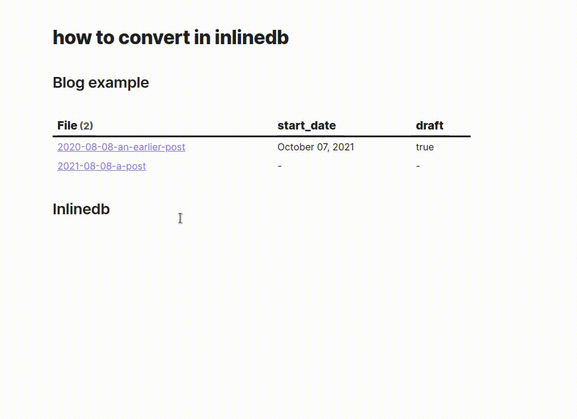

# Dataview inlineDB

Dataview inlinedb is a custom view for dataview plugin in obsidian. It provides an editable table for dataview queries. 

Inspired by [Obsidian DB Folder](https://github.com/RafaelGB/obsidian-db-folder) and custom views from @702573N. Also relies on [MetaEdit](https://github.com/chhoumann/MetaEdit) plugin.



## Installation

1. Install dataview and metaedit plugin in obsidian.
2. Download zip archive from release.
3. Copy folder inlinedb to dataview scripts folder.
4. Call custom view with dataviewjs with either query, or `dv.table` like syntax.

Example for query:
```dataviewjs
const query = `TABLE
  time-played AS "Time Played",
  length AS "Length",
  rating AS "Rating"
FROM "games"
SORT rating DESC`;
await dv.view('inlinedb', {query: query});
```

Example for dv.table:
```dataviewjs
const headers = ["File", "Genre", "Time Read", "Rating"];
const values =  dv.pages("#book")
    .sort(b => b.rating)
    .map(b => [b.file.link, b.genre, b["time-read"], b.rating]);
// don't forget await!
await dv.view('inlinedb', {headers: headers, values: values});
```

## Configuration

By default, inlinedb will try to guess the [data types](https://blacksmithgu.github.io/obsidian-dataview/annotation/types-of-metadata/) for columns from values. 
Allowed types:
- `readonly` - for built-in fields, objects, lists, html-like structures and fields not presented in file metadata (like formulas).
- `date` - if dataview query returns Luxon object with zeroed hours, minutes, seconds and milliseconds.
- `choice` - from metaedit autoproperties settings or column settings.
- `number` - to change number.
- `text` - for simple text modification.

Not supported for editing: `list`, `objects`, `tags`, `link`, `datetime`.

But for null values, it can not be done via values. So you can pass columns config.
```dataviewjs
const query = `TABLE
  time-played AS "Time Played",
  length AS "Length",
  rating AS "Rating"
FROM "games"
SORT rating DESC`;
const columns = {
    "time-played": "number",
    "rating": {
        "type": "choice",
        "choices": [1,2,3,4,5],
    }
}
await dv.view('inlinedb', {query: query, columns: columns});
```

For better example, you can open [example_vault](example_vault/example%20inlinedb.md) with obsidian.

## Known limitations

1. View only supports `TABLE` query and will show error for other types.
2. View only supports `TABLE` with files. `TABLE WITHOUT ID` will not work.
3. For values array you need to pass link as first element.
4. A several table in notes can be glitchy due to dataviewjs refresh index job.

## FAQ

> Why not Obsidian DB Folder?

I want to move my views from dataview queries to some inline notion-like tables, but DB folder was UI configurable separated view from notes with tough yaml under it. So with the inlinedb, you can do all things in dataview query, pass to the custom view and 

> Why not plugin?

This is an MVP via dataview custom views functionality, but can be extented to the plugin. I just don't know if want to code it via preact/react/svelte/whatever is mainstream nowadays on frontend.

> How do I filter views?

Via a dataview query `WHERE` keyword. (:

> How do I sort table?

Via a dataview query `SORT BY` keyword.
